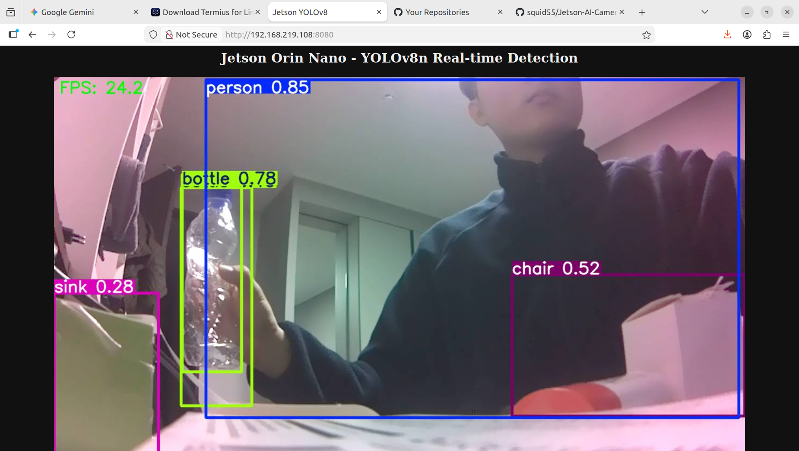

# Jetson AI Camera

Jetson Orin Nano 4GB + IMX219 MIPI Camera를 이용한 실시간 AI 객체 탐지 시스템.

추후 Zybo Z7-20 FPGA CNN과 연동하여 **FPGA 초저지연 전처리 + GPU 고정밀 추론** 융합 시스템 구축 예정.


*YOLOv8n TensorRT INT8 실시간 객체 탐지 (24.2 FPS, Jetson Orin Nano 4GB)*

## Hardware

| 장치 | 역할 |
|------|------|
| Jetson Orin Nano 4GB | YOLOv8n TensorRT INT8 실시간 추론 |
| IMX219 (RPi Camera v2) | MIPI CSI 카메라 |
| Zybo Z7-20 (예정) | FPGA CNN 전처리 (MNIST 숫자 인식) |

## Setup

```bash
# 1. Jetson 초기 설정
bash scripts/setup_jetson.sh

# 2. MIPI 카메라 테스트
python3 scripts/test_cameras.py

# 3. TensorRT 엔진 빌드
python3 scripts/export_tensorrt.py

# 4. 실시간 객체 탐지 스트리밍
python3 yolo_stream.py
# 브라우저에서 http://<jetson-ip>:8080 접속
```

## Project Structure

```
├── config.yaml              # 전체 설정 (네트워크, 카메라, 모델, 융합)
├── fusion_server.py         # Zybo + YOLO 융합 서버 (Phase 3)
├── yolo_stream.py           # YOLOv8 실시간 탐지 + 웹 스트리밍
├── stream_server.py         # 카메라 전용 웹 스트리밍
├── requirements.txt         # Python 의존성
└── scripts/
    ├── setup_jetson.sh      # 초기 설정 (GUI 끄기, SWAP, 성능모드)
    ├── export_tensorrt.py   # YOLOv8n → TensorRT INT8 변환
    ├── test_cameras.py      # 듀얼 MIPI 카메라 테스트
    └── test_zybo_recv.py    # Zybo UDP 수신 테스트
```

## Environment

- JetPack 6.2.2 (L4T R36.5)
- CUDA 12.6 / TensorRT 10.3 / cuDNN 9.3
- PyTorch 2.5.0 (NVIDIA Jetson build)
- Ultralytics 8.4.30
- OpenCV 4.8.0 (system, GStreamer enabled)

## Related

- [Zybo-Z7-Pcam-MNIST-CNN](https://github.com/squid55/Zybo-Z7-Pcam-MNIST-CNN) — Zybo FPGA CNN
- [CNN-VHDL-MNIST](https://github.com/squid55/CNN-VHDL-MNIST) — CNN VHDL 코어
